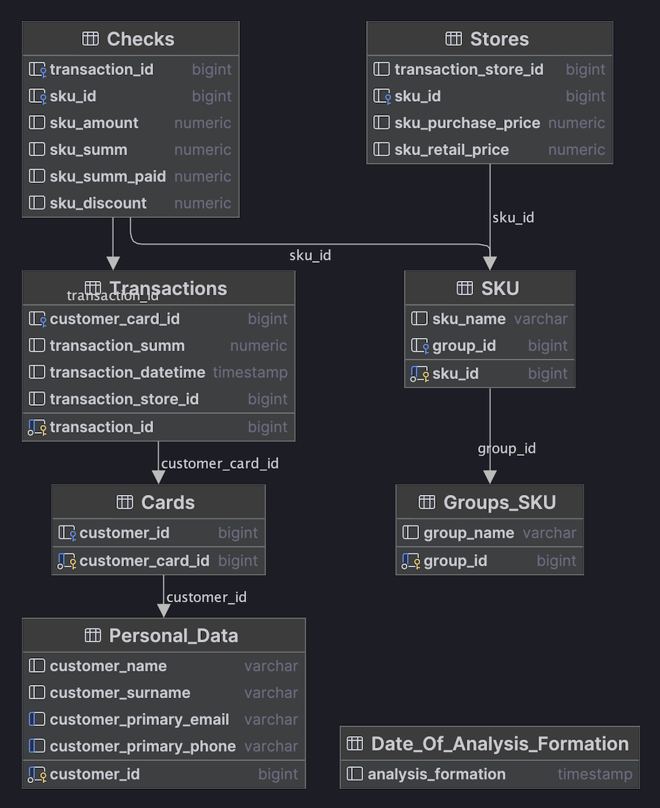

# RetailAnalytics v1.0 - Data Upload, Analysis, Statistics, Customer Segmentation and Personal Offers Creation

## Overview
RetailAnalytics v1.0 project involves creating a database with retail analytics data, performing simple analysis, generating statistics, segmenting customers, and creating personal offers.

## Database Structure
The database for the RetailAnalytics v1.0 project consists of several tables:

1. **Personal Information Table**: Stores personal information about the customers.
2. **Cards Table**: Stores information about the customer's cards.
3. **Transactions Table**: Stores information about the transactions made by the customers.
4. **Checks Table**: Stores information about the checks made by the customers.
5. **Product Grid Table**: Stores information about the products.
6. **Stores Table**: Stores information about the stores.
7. **SKU Group Table**: Stores information about the SKU groups.
8. **Date of Analysis Formation Table**: Stores information about the date of analysis formation.

## Tasks

### Task 1: Creating a Database
- **`part1.sql`** Script that creates the database and all the tables 
  described in the database structure. And procedures  that allow 
  you to import and export data for each table from/to a file with a `.csv` or `.tsv` extension.

### Task 2: Creating Views
- **`part2.sql`** Scripts what writes views described below.
- * **Customers View**: Provides information about each customer, including their unique ID, average check value, transaction frequency, churn rate, and more.
* **Purchase History View**: Provides information about each transaction made by a customer, including the transaction ID, date, SKU group, prime cost, base retail price, and actual cost paid.
* **Periods View**: Provides information about each group of related products, including the customer ID, SKU group, date of first and last purchase, number of transactions with the group, intensity of group purchases, minimum group discount, and more.
* **Groups View**: Provides information about each group, including the customer ID, group ID, affinity index, churn index, stability index, actual margin for the group, share of transactions with a discount, minimum size of the discount, and average discount.

### Task 3: Role Model
- **`part3.sql`** Script creates roles and give them permissions.

### Task 4: Forming Personal Offers Aimed at the Growth of the Average Check
- **`part4.sql`** Script creates a function, which determines offers that 
  aimed at the growth of the average check.

### Task 5: Forming Personal Offers Aimed at Increasing the Frequency of Visits
- **`part5.sql`** Script creates a function, which determines 
  offers aimed at increasing the frequency of visits.

### Task 6: Forming Personal Offers Aimed at Cross-Selling
- **`part6.sql`** Script creates a function, which 
  determines offers aimed at cross-selling (margin growth).